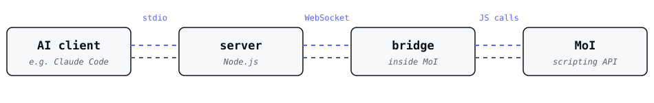

<div align="center">

# mcp-bridge-for-moi

### Let an AI agent model in MoI3D while you watch.


</div>

https://github.com/user-attachments/assets/a531fb67-fff5-4365-9cab-18e11468b26e

This is a small bridge between an AI assistant (e.g. Claude Code, Claude Desktop, or any other
client that speaks the Model Context Protocol) and a copy of MoI3D v4 that is open on your screen.
You describe what you want, the agent builds it in your open document, looks at the result, and
corrects itself. You can step in at any moment: select something to point at it, undo a step, or
take over.

It works in ***your*** MoI. It doesn't drive a hidden copy and it isn't a batch converter.

> [!NOTE]
> **Unofficial.** This project is not affiliated with, endorsed by, or supported by Triple Squid
> Software. MoI and MoI3D are trademarks of their owner and are used here only to say which
> program this tool works with. You need your own licensed copy of MoI.

> [!WARNING]
> **Use with caution.** This is a spare-time project. It is tested, but it may still contain bugs.
> Save your work before you let an agent loose on it, keep backups of anything that matters, and
> watch what the agent does. You use it at your own risk (see [Disclaimer](#disclaimer)). Read [Safety](#safety) and
> [Limitations](#limitations) before you start.

---

## Contents

- [What it's like to use](#what-its-like-to-use)
- [How it works](#how-it-works)
- [Safety](#safety)
- [Limitations](#limitations) — [Commands a script can't run](#commands-a-script-cant-run) · [Factory quirks](#factory-quirks) · [Files and export](#files-and-export) · [Seeing the model](#seeing-the-model) · [Sessions](#sessions) · [Where it runs](#where-it-runs)
- [Requirements](#requirements)
- [Setup](#setup)
- [Commands](#commands) — [On the command line](#on-the-command-line) · [What the agent can call](#what-the-agent-can-call)
- [Things the agent has to know](#things-the-agent-has-to-know) — [Error codes](#error-codes)
- [The eval log](#the-eval-log)
- [Version support](#version-support) · [Platforms](#platforms)
- [The research behind it](#the-research-behind-it)
- [Built with](#built-with)
- [Disclaimer](#disclaimer) · [License](#license)

---

## What it's like to use

- **The agent never saves your file.** It can create, change and delete objects, but nothing is
  written to disk. Close MoI without saving and all its work is gone. Save whatever you want to keep.
- **One <kbd>Ctrl</kbd>+<kbd>Z</kbd> undoes one agent step.** However much the agent does in a single call, one undo
  takes all of it back.
- **Your own command comes first.** If you're in the middle of a MoI command (e.g. Line, waiting for
  its start point), the agent can still look at the scene, but it can't change anything until you
  finish or cancel.
- **No MoI, no tools.** If MoI isn't running with the bridge installed, the agent gets a clear error
  message instead of silently doing nothing.

---

## How it works

<picture>
  <source media="(prefers-color-scheme: dark)" srcset="docs/images/how-it-works-dark.svg">
  
</picture>

There are two parts:

- the **bridge**, a single script in MoI's startup folder. It starts with MoI, waits for the server
  to appear, and connects when it does.
- the **server**, which your AI client starts. It talks to the agent on one side and to the bridge
  on the other.

---

## Safety

> [!WARNING]
> **`moi_eval` can reach beyond MoI.** It runs whatever JavaScript the agent writes, inside MoI, and
> MoI's scripting API is not limited to geometry: it can read and write files
> (`moi.filesystem.openFileStream`) and start programs (`moi.filesystem.shellExecute`). A script run
> through `moi_eval` can do anything your user account can do. The other tools are narrow and do only
> what their description says.

Normal modelling never touches those calls. Harm would take a bad instruction: an agent's mistake,
or text the agent read somewhere (a file, a web page) that talks it into running something it
shouldn't.

- **Never run MoI as administrator.** Under a normal account, Windows keeps the system folders
  (e.g. `C:\Windows`, `C:\Program Files`) out of reach. Elevated, nothing does.
- **Keep your AI client's approval prompt on for `moi_eval`**, and read the script before you allow
  it. Be wary of any script that mentions `filesystem`, `shellExecute` or a path outside your
  project.
- **Back up what matters.** Your own files are within reach of your own account.
- **Check the [eval log](#the-eval-log)** if something looks wrong. It records every script that
  was run.

What the tool itself writes to disk:

- into MoI's app data folder (`%APPDATA%\Moi\`): the bridge in `startup\`, one command file in
  `commands\`, a small handshake file, and the eval log;
- picture files in your temp folder, which are deleted as soon as they have been read;
- the files you ask `export_objects` to create. It ***never*** overwrites an existing file.

> [!NOTE]
> The server accepts connections from this computer only (`127.0.0.1`), and only with a token it
> generates at each start. It listens on no network.

---

## Limitations

What the agent can't do, or can do only in part. Check this list before you ask for something.

### Commands a script can't run

MoI has 110 geometry factories. The agent can run 103 of them from a script. **The agent can't use
these 7.** Five take their input from an interactive pick in a viewport, which a script has no way to
provide. The other two produce nothing when run from a script. You can still run them yourself in MoI while the agent works.

| Factory | Where it is in MoI | Why a script can't drive it |
|---|---|---|
| `addpoint` | *Edit > Add pt* | Takes its point from a point picker with snapping. There's no input a script can set. |
| `arccontinue` | *Draw curve > Arc > Cont* | The start point has to be snapped onto a curve. A point from a script isn't tied to any curve. |
| `arctangent` | *Draw curve > Arc > Tan* | The two tangent points have to be snapped onto curves. |
| `circletangent` | *Draw curve > Circles > Tan* | The two tangent points have to be snapped onto curves. |
| `sketchcurve` | *Draw curve > Freeform > Sketch* | Draws from a stream of mouse positions, not from inputs. |
| `dimradius` | *Dim > Radius* | Produces nothing when run from a script. MoI's own command restricts its pick to the circle's plane, and a script can't do that. |
| `nsided` | *Construct > Nsided* | Produces nothing when run from a script, whatever curves it's given. |

> [!NOTE]
> The agent can often get the same shape another way. For example, it can work out a tangent arc's
> points itself and draw it with `arc3pt`. Check the result, though: the curve isn't tied to the
> curves it touches.

The other 103 are each committed with real inputs, and their output checked, by
`npm run e2e:factories`.

### Factory quirks

<!-- The same warning is FACTORY_POINT_NOTE in src/tools/moi-eval.ts, which the agent reads.
     Reword one, reword both; a test checks they still name the same inputs. -->
- **`cylinder` and `cone` need their end point, not the height.** Driven from a script they ignore
  `Height` unless `End pt` is set, and quietly give a flat circle instead of a solid. Check the
  output's `isSolid` before you use it in a boolean.
- **One input type has no name.** `moi_factory_help` shows the type of `loft`'s `Orientations` and
  `chamfer`'s `Corners` as `type9`, because what that type holds is not known. The agent leaves
  these inputs at their defaults.

### Files and export

- **The agent never saves, opens or closes a document.** Save your own work. See
  [ADR-0004](docs/adr/0004-the-agent-never-saves.md).
- **`export_objects` doesn't write `.3dm`**, and never overwrites an existing file.
- **Only one mesh setting is exposed.** `export_objects` can set the mesh `angle`. The other
  settings in MoI's mesh dialog (e.g. output type, welding, dividing large faces) can't be reached
  and follow whatever you last chose in that dialog.

### Seeing the model

- **The whole-window picture is a screenshot.** `get_view` with `viewport: "window"` photographs the
  screen, so MoI has to be visible and the size can't be chosen. Pictures of single viewports don't
  have these limits. See [ADR-0005](docs/adr/0005-the-agent-sees-by-rendering.md).
- **The agent checks count and type, not shape.** It finds out whether a command made a solid or a
  curve from the scene, and whether the shape looks right only from pictures. Look at the result
  yourself.

### Sessions

- **A document with no unit system has to get one first.** While the open document has no
  unit system, `moi_eval` and `export_objects` answer `[no_units]`, so nothing is modelled or
  exported in numbers that mean nothing. The agent asks you which units to use (millimeters,
  centimeters, meters, kilometers, inches, feet or miles) and sets them with `set_units`. Looking
  at the document works as before. `set_units` never changes units a document already has;
  change those yourself in MoI's Options. Set a default unit system in MoI (see [Setup](#setup))
  and new documents never ask.
- **One MCP client at a time.** Only one server can serve MoI. A second client gets
  `[server_conflict]` until the first one closes (see [Setup](#setup)).
- **Your command blocks the agent's changes.** While you're in the middle of a MoI command, the
  agent can look but can't change anything.
- **A MoI that stays stuck can lose its session.** If MoI is still busy 45 seconds after one of
  the agent's calls has timed out, a second MoI waiting to connect can take the session over.
- **Scripts are ES5.** MoI runs old JavaScript, so a script the agent writes with `let`, `const` or
  arrow functions fails, and the agent has to rewrite it.

### Where it runs

- **MoI 4 only.** MoI 3 and MoI 5 aren't supported (see [Version support](#version-support)).
- **Windows only.** macOS is untested (see [Platforms](#platforms)).
- **No batch conversion**, on purpose: converting a folder of files doesn't need a live session and
  belongs in a separate, simpler tool.

---

## Requirements

- **MoI 4** (the only version supported, see [Version support](#version-support))
- **Node.js 22 or newer**
- **Windows** (macOS is untested, see [Platforms](#platforms))

---

## Setup

The package isn't on npm, so you install it from a copy of this repository.

**1. Get the code and build it**

```bash
git clone <this repository's URL>
cd mcp-bridge-for-moi
npm install
npm run build
```

**2. Install the bridge into MoI**

```bash
node dist/cli.js install
```

This copies the bridge into `%APPDATA%\Moi\startup\` and prints where it put it. **Restart MoI.**
If you'd rather do it by hand, copy `assets/bridge.js` into that folder under any name that ends
in `.js`.

**3. Tell your AI client about the server** by adding this to its MCP configuration:

```json
{
  "mcpServers": {
    "moi": {
      "command": "node",
      "args": ["<repository folder>/dist/cli.js"]
    }
  }
}
```

*e.g.* `"args": ["D:/tools/mcp-bridge-for-moi/dist/cli.js"]`

> [!WARNING]
> **Register the server in one MCP client only.** Each client starts its own copy of the
> server, and only one can serve MoI at a time. The first one to start owns MoI; any other
> stands aside, and every tool call on it answers:
>
> ```text
> [server_conflict] MoI is already served by another mcp-bridge-for-moi (started by <client>,
> process <pid>, since <time>). Only one can run at a time. ...
> ```
>
> Close the application named there, or end that process, and call again. The waiting server
> takes over on its next call, with no restart.

**4. Set a default unit system in MoI** (*Options > General > Units options*). A new MoI
document otherwise has no unit system, and the agent has to ask you for one before it can
model or export (see [Limitations](#sessions)). With a default set, new documents never ask.

> [!NOTE]
> After you pull a newer version, **rebuild and run `install` again.** The bridge is a copy that
> nothing updates on its own. If it gets out of date, the server refuses to connect and tells you so.

---

## Commands

### On the command line

| Command | What it does |
|---|---|
| `npm install` | Downloads the three libraries the server needs. Run it once after cloning. |
| `npm run build` | Compiles the TypeScript in `src/` into `dist/`. Run it after cloning and after every update. |
| `npm test` | Builds, then runs the test suite. MoI doesn't need to be running for this. |
| `npm run e2e` | Builds, then drives a running MoI through every tool once and reports pass or fail per step. Use an empty document; it builds one box, exports it to a temporary folder that it removes afterwards, and deletes the box again. On a document with no unit system it sets millimeters for the run and removes them again at the end. It never saves or closes MoI. **Close your AI client first** — only one server can serve MoI at a time, so while your client's server runs the test stops at once with `[server_conflict]` and names it. Restart the client afterwards. If no MoI connects within 90 seconds it fails and says so. |
| `npm run e2e:factories` | Builds, then runs every factory MoI has, one at a time: it builds what the factory needs, commits it, checks what it made, and checks that MoI still answers. The factories a script can't drive (see [Limitations](#limitations)) are skipped with their reason. Prints one `PASS`, `FAIL` or `SKIP` line per factory and the counts. It refuses to start unless the document is empty, deletes anything a factory leaves behind, and never saves or closes MoI. **Close your AI client first**, as for `npm run e2e`. |
| `node dist/cli.js install` | Copies the bridge into MoI's startup folder. Run it again after every update. |
| `node dist/cli.js` | Starts the server. You normally never type this: your AI client runs it from its configuration. |

### What the agent can call

These are the tools the agent sees. You don't call them yourself; you ask the agent, and it picks the
right one.

The **Kind** column says what a tool can do to your work:

- ***read-only*** — only looks. Nothing in MoI or on disk changes.
- ***changing*** — changes what you see or a document setting (selection, view, layout, units),
  but never creates, alters or removes geometry.
- ***writes a file*** — leaves MoI as it was and writes a new file to disk.
- ***destructive*** — can create, alter or remove geometry.

Your AI client sees the same information, so it can, for example, run read-only tools without
asking and ask you before a destructive one.

| Tool | Kind | What it does |
|---|---|---|
| `moi_eval` | **destructive** | Runs a piece of JavaScript against MoI's scripting API. This is how the agent actually builds geometry. |
| `set_units` | *changing* | Gives a document that has no unit system the units you chose (e.g. millimeters, inches). It never changes units a document already has. |
| `moi_factory_help` | *read-only* | Explains how to use any of MoI's 110 geometry "factories" (box, loft, fillet, …): what each input means, with examples taken from MoI's own scripts. |
| `get_scene` | *read-only* | Lists every object in the document: id, name, type, whether it is a closed solid (`isSolid`), style, visibility, size, plus the document's units. |
| `get_selection` | *read-only* | Returns whatever you have selected, with the same details, so you can point at things instead of describing them. |
| `set_selection` | *changing* | Selects objects, so the agent can show you what it means. |
| `delete_objects` | **destructive** | Deletes exactly the objects named, nothing else. |
| `get_view` | *read-only* | Takes a picture of a viewport (3D, Top, Front, Right) so the agent can check its own work. It can aim the camera at particular objects for that one picture without moving your view or your selection, and it still works when MoI is minimized. |
| `set_view` | *changing* | Points one of your viewports at chosen objects, the selection, or the whole scene, optionally from a named angle. |
| `set_viewport_layout` | *changing* | Switches MoI between the four-viewport layout and a single viewport. |
| `export_objects` | *writes a file* | Writes chosen objects, or the whole scene, to a new file in any format MoI exports (e.g. STEP, OBJ, STL), picked by the extension. It never opens a dialog, never overwrites an existing file, and doesn't write `.3dm`. Your open document, its name and your selection are left as they were. |

---

## Things the agent has to know

These are already in the tool descriptions. They're listed here because they explain most mistakes
you'll see:

- **MoI's scripting language is old JavaScript (ES5).** No `let`, `const`, arrow functions or
  `Promise`. The agent sometimes forgets.
- **Object ids change.** Any operation that consumes an object, even a plain move, replaces it with
  a new one that has a new id. The agent has to read ids from each result instead of reusing old
  ones. The reasoning is in [ADR-0003](docs/adr/0003-raw-guids-no-handle-table.md).
- **To find what was created, compare before and after.** Some MoI factories don't report what they
  made. The built-in `capture( fn )` helper compares the scene before and after, and works for all of
  them: it reports what was created and the ids of what was consumed.
- **A factory that cannot do its job fails silently.** MoI commits a fillet, chamfer or shell that
  is too large for the geometry without any error, and leaves the model unchanged. When a `capture`
  sees nothing created and nothing consumed it adds a warning, and `moi_eval` repeats it after the
  script's result. Factories that only measure, or add a background image, create nothing when they
  succeed, so the warning is a prompt to check, not a verdict.

### Error codes

A refused or failed call starts with its code in brackets, e.g. `[no_units]`:

| Code | What it means |
|---|---|
| `bad_request` | The server refused the call before asking MoI, because its arguments cannot mean anything: e.g. `padding` without a `frame` (on `get_view` or `set_view`), a real `frame` or an `angle` with the `get_view` window shot, or an export path that already exists. |
| `no_units` | A modelling or export call on a document with no unit system. The agent asks you which units to use and calls `set_units`. |
| `units_set` | `set_units` on a document that already has units. Nothing changed; to change units, use MoI's Options. |
| `command_running` | You have a command running in MoI, so a call that would change something is refused until you finish or cancel it. |
| `no_session` | MoI isn't connected to the server. |
| `server_conflict` | Another copy of the server is already serving MoI. |
| `timeout` | MoI didn't answer in time. |
| `script_error` | The script the agent sent threw an error inside MoI. |
| `moi_error` | MoI reported a failure, or answered something the server couldn't use. |
| `not_found` | Something the call needed wasn't there, e.g. none of the ids given to `export_objects` exist. |

A missing or unknown argument, such as a missing or misspelled `layout` for
`set_viewport_layout`, is refused by the tool's schema instead, naming the valid values.

---

## The eval log

Every `moi_eval` call is written to `mcp-bridge-for-moi-eval.log` in MoI's app data folder
(`%APPDATA%\Moi\`): the script the agent wrote and what MoI answered. The log stays on your machine
and is never uploaded. It rotates at 4 MB.

> [!NOTE]
> It's the best bug report there is. If the agent keeps getting something wrong, that file shows
> exactly what it tried.

---

## Version support

MoI 4 only. MoI 3's scripting API is different in ways that matter, and MoI 5 hasn't been tested.
The bridge checks the version when MoI starts and does nothing on any other version. The research in
[`docs/research/`](docs/research/) is the starting point if you want to add another version.

## Platforms

Windows is supported. macOS is untested, and `install` won't write there. The server is plain
Node.js and should be fine. What nobody has checked yet is whether MoI's Mac build runs the bridge
the same way.

macOS support is not planned, for one reason: nobody working on this has a Mac to check it on, and
a code path that can't be run isn't worth shipping. It isn't ruled out — the remaining work is
small, and three answers would unblock it:

1. Where does MoI for macOS keep its startup and commands folders?
2. Copied by hand into that startup folder, does the bridge script run when MoI starts, and does
   MoI's log show `[mcp-bridge-for-moi] bridge armed`?
3. With the MCP server running, does `get_scene` answer?

> [!NOTE]
> **If you have MoI for macOS, please open an issue with what you find** — either way, including
> "it doesn't work".

---

## The research behind it

`docs/research/` holds the experiments run against a real MoI install, and `prototypes/` the scripts
and output of each one. `docs/adr/` records the decisions that would otherwise look strange:

- [ADR-0001](docs/adr/0001-bridge-hosted-in-side-pane-window.md): why the bridge lives in the side
  pane's window rather than being a command
- [ADR-0002](docs/adr/0002-gate-poll-before-websocket.md): why it polls with XHR before it opens a
  socket
- [ADR-0003](docs/adr/0003-raw-guids-no-handle-table.md): why objects are raw GUIDs and there's no
  handle table
- [ADR-0004](docs/adr/0004-the-agent-never-saves.md): why the agent never saves
- [ADR-0005](docs/adr/0005-the-agent-sees-by-rendering.md): why the agent sees by rendering rather
  than by grabbing the screen

> [!NOTE]
> If you're about to simplify something here, read those first. Most of the odd-looking choices are
> there for a reason.

---

## Built with

**Nothing has to be downloaded apart from Node.js and MoI itself.** `npm install` fetches the
server's libraries; the bridge has no dependencies at all.

| Component | What the tool uses it for | Where it comes from | License |
|---|---|---|---|
| [MoI3D](https://moi3d.com/) | The CAD program being driven. Not bundled and not modified; you need your own copy. | moi3d.com | **Commercial**, paid |
| [Node.js](https://nodejs.org/) | Runs the server. Standard library modules used: `http`, `crypto`, `fs`, `path`, `os`, `url`, `node:test`. | nodejs.org | MIT |
| [`@modelcontextprotocol/sdk`](https://github.com/modelcontextprotocol/typescript-sdk) | Talks MCP to the agent over stdio. | npm | MIT |
| [`ws`](https://github.com/websockets/ws) | The WebSocket server the bridge connects to. | npm | MIT |
| [`zod`](https://zod.dev/) | Checks the arguments the agent sends to each tool. | npm | MIT |
| [TypeScript](https://www.typescriptlang.org/) | Compiles the server. Used at build time only, not shipped. | npm | Apache-2.0 |
| [acorn](https://github.com/acornjs/acorn) | Checks in the test suite that every script sent to MoI is ECMAScript 5. Used by the tests only, not shipped. | npm | MIT |

MoI is the only commercial component and the only thing you have to get yourself. Everything else is
free software.

---

## Disclaimer

This tool is provided **"as is", without warranty of any kind**, express or implied, including but
not limited to the warranties of merchantability, fitness for a particular purpose and
non-infringement. You use it entirely at your own risk.

The author and contributors are not liable for any claim, damage or other loss arising from its
use or from being unable to use it: lost or corrupted models, damaged or deleted files, harm to your
system, lost work or time, or anything an AI agent does through it. Checking what the agent does,
saving your work and keeping backups is your responsibility alone.

The licenses below say the same in their own terms (GPL v3, sections 15 and 16; the MIT license's
final paragraph). Where this summary and a license differ, the license applies.

## License

**The server code is licensed under the [GNU GPL v3](https://www.gnu.org/licenses/gpl-3.0.html)**
(see [`LICENSE`](LICENSE)). You may use, study, change and share it. If you distribute a modified
version, it has to stay free under the same terms.

**The bridge (`assets/bridge.js`, the script that runs inside MoI) is
[MIT](https://opensource.org/licenses/MIT)** (see [`assets/LICENSE-bridge`](assets/LICENSE-bridge)).
It's the permissive half on purpose: people will want to read it, copy it and reuse it in their own
MoI scripts, and that should be easy.

**The documentation is licensed [CC BY 4.0](https://creativecommons.org/licenses/by/4.0/)**: use it,
adapt it, and credit it.

*This summary is not a license. The linked texts are the actual terms.*
